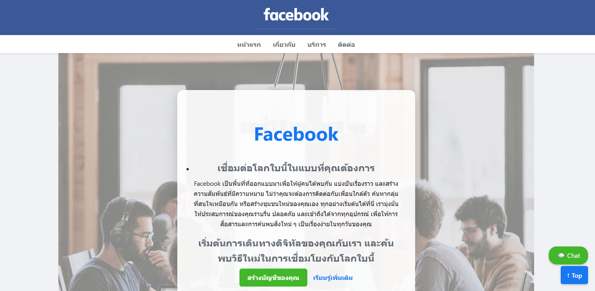
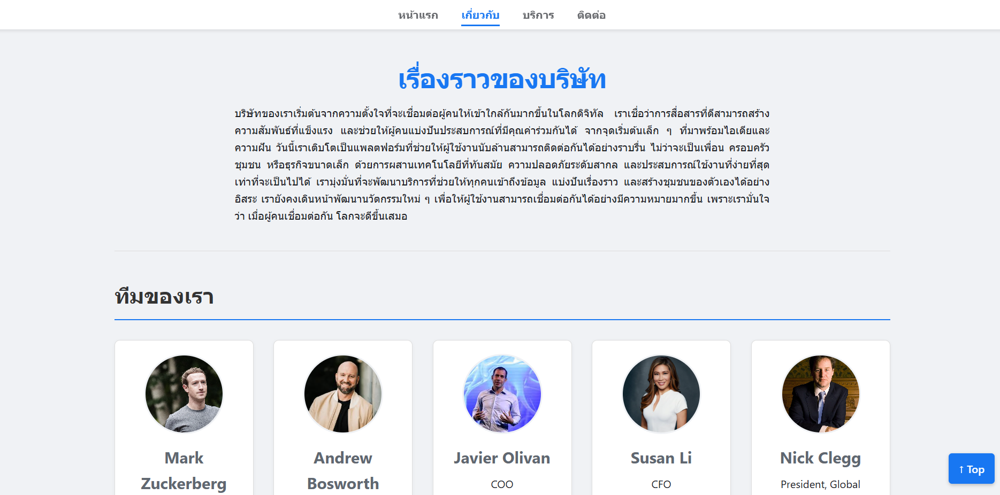
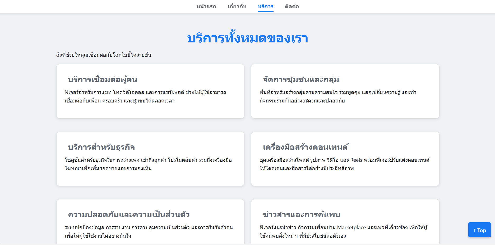
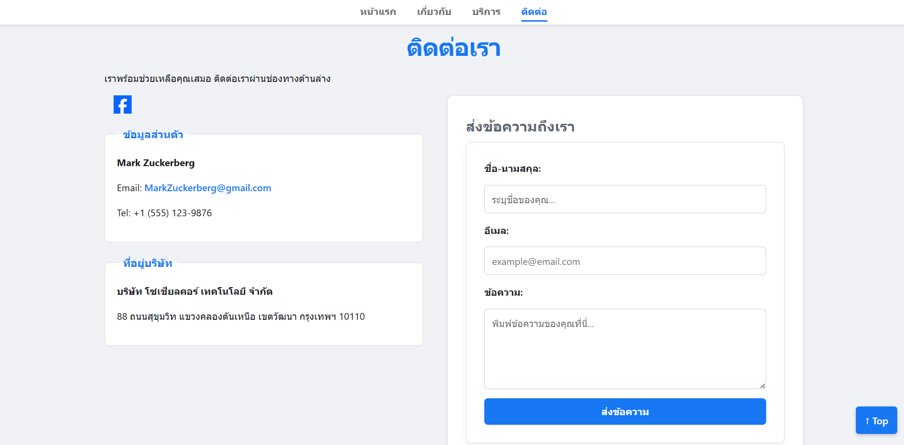

# MeowTa - The Social Network for Cats

## About the Project

This project is a responsive business website for **MeowTa**, the world's leading social network designed exclusively for cats. It showcases a platform where felines can connect, share nap spots, demand treats, and organize against the tyranny of vacuum cleaners.

The project demonstrates modern HTML5 and CSS3 techniques, focusing on responsive design, flexbox/grid layouts, and a warm, user-friendly interface suitable for paws.

## Website Pages

| Page     | Description                                                      | Link                           |
| -------- | ---------------------------------------------------------------- | ------------------------------ |
| Home     | Hero section with cat community background & key features        | [index.html](index.html)       |
| About    | The Legend of MeowTa, Mission/Vision, and the Executive Cat Team | [about.html](about.html)       |
| Services | VIP Cat Services (Catnip/Vet) & Membership Pricing Table         | [services.html](services.html) |
| Contact  | Contact Human Support, Complaint Form, and Office Map (No Dogs)  | [contact.html](contact.html)   |

## File Structure

## CSS Implementation

### Selectors

| Type         | Examples                                | Usage                                 |
| ------------ | --------------------------------------- | ------------------------------------- |
| Universal    | `*`                                     | Reset margin, padding, box-sizing     |
| Element      | `body`, `h1`, `h2`, `img`, `table`      | Base typography and layout structure  |
| Class        | `.container`, `.card`, `.btn`, `.hero`  | Reusable components and theme styling |
| ID           | `#Header`, `#footer`, `#mission-vision` | Unique page sections                  |
| Pseudo-class | `:hover`, `:nth-child(even)`            | Interactive states and table striping |

### Color Palette (MeowTa Theme)

| Color           | Hex Code  | Usage                                    |
| --------------- | --------- | ---------------------------------------- |
| **Meow Orange** | `#ff8c00` | Headers, Primary Buttons, Borders, Icons |
| **Warm Cream**  | `#fffbf0` | Page Background (Soft & Comfortable)     |
| **Fresh Green** | `#2ecc71` | Action Buttons (Sign Up / Chat)          |
| **Dark Blue**   | `#2c3e50` | Footer Background                        |
| **White**       | `#ffffff` | Cards, Navbar, Content Areas             |

### Typography

- **Font Family:** "Prompt", "Roboto", "Segoe UI", sans-serif
- **Font Styles:** Bold headers (`700`), Readable body text (`400`)
- **Text Effects:** `text-shadow` (Hero section), `line-height` adjustment for readability.

### Layout Systems

| System             | Usage                                                  |
| ------------------ | ------------------------------------------------------ |
| `display: flex`    | Navigation menu, Team members (row of 5), Contact form |
| `display: grid`    | Services cards, Mission/Vision layout                  |
| `position: sticky` | Navigation bar stays at the top                        |
| `position: fixed`  | "Back to Top" button and Chat widget                   |
| `background-image` | Hero section with linear-gradient overlay              |

### Responsive Design

- **Mobile First Approach:** Using standard block layout.
- **Media Queries (`max-width: 768px`):**
  - Stacks navigation links for mobile view.
  - Converts Grid/Flex layouts to single columns (Cards, Team members).
  - Adjusts padding and font sizes for smaller screens.
  - Hides floating chat widget on mobile.

---

## Screenshots

_(Place your screenshots in the 'images' folder and update paths below)_

### Home Page

### About Page

### Services Page

### Contact Page

---

© 2025 MeowTa Corp. All rights reserved. (Humans are just support staff).
